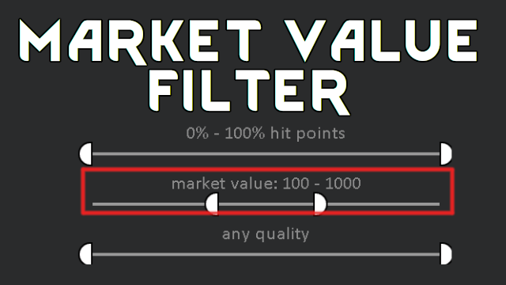

# Market Value Filter

Adds a 'market value' filter to stockpile and ingredient selectors.

Inspired by [Perishable Spoil Time Filter](https://steamcommunity.com/sharedfiles/filedetails/?id=2178652457) and [it's 1.4 port](https://steamcommunity.com/sharedfiles/filedetails/?id=2912343138).

## You may also like...

https://github.com/zed-0xff/RW-MarketValueFilter

## Support me

 or [Patreon](https://www.patreon.com/zed_0xff)
